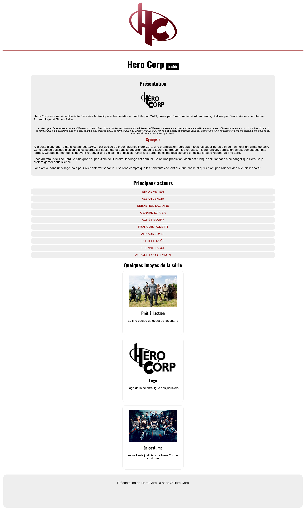
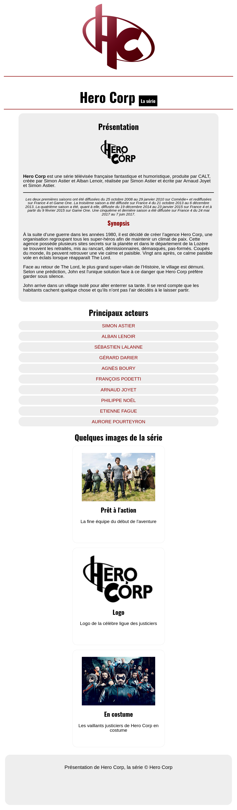
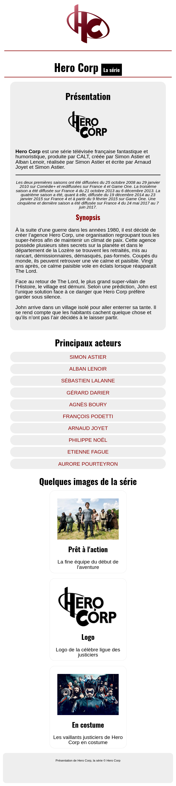

# Hero Corp AT1 - CP2 : Réaliser une interface statique et adaptable

The objective of this exercise is to create a static interface while respecting the semantics of HTML tags, as well as to create the responsive part using media queries. Two breakpoints were used, the first under 1024px and the second between 768px and 320px.

## Built with

1. HTML
2. CSS

## Result

### Desktop

### Tablet

### Mobile

This exercise was designed by the O'clock school.
